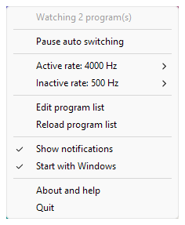
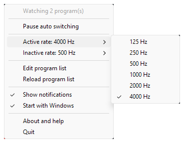
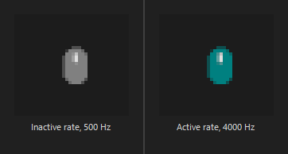
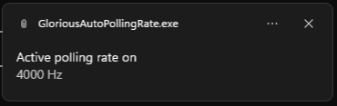

# Glorious Auto Polling Rate

A tiny Windows tray tool that raises your Glorious mouse polling rate while a game is open and drops it back the rest of the time. High rate when it matters, low rate to save wireless battery, and you never think about it.



Glorious CORE only gives you one global polling rate, so it is high everywhere or low everywhere. This flips it per game instead, from a 0.50 MB executable with no installer, no Electron, no background service, and 0.01 percent of one CPU core.

## Behavior

> If any program on your list is running, use the **active** rate. Otherwise use the **inactive** rate.

Running, not focused. Alt tab to Discord mid match and the rate stays high, because the game is still open. It drops back a couple of seconds after you close it.

- Two rates, picked from the tray menu, applied instantly and remembered.
- A plain text list of programs. One `.exe` per line.
- Starts with Windows by default, with a tray toggle to turn it off.
- Pause switching from the tray at any time.
- Optional notification on each change.

## Supported mice

Windows 10 or 11, 64 bit.

| Your mouse | Works? |
| --- | --- |
| **Model D2 Pro 4K** | Yes, nothing to set up. Built and tested against this one. |
| **Model O2 Pro 4K** | Almost certainly, after [one line of config](#using-a-different-glorious-mouse). Not yet confirmed on hardware. |
| Another Glorious mouse | Yes, after a one time capture of about fifteen minutes. |
| A non Glorious mouse | No. |

## Install

1. Download `GloriousAutoPollingRate.exe` from [Releases](https://github.com/amarcinkiewicz/GloriousAutoPollingRate/releases).
2. Put it in a folder you like, for example `C:\Tools\GloriousAutoPollingRate\`.
3. Double click it. A mouse icon appears in the tray and it sets itself to start with Windows.
4. Right click the icon, choose Edit program list, add your games, save, then choose Reload program list.
5. Pick your active and inactive rates from the same menu.

## Using it

**Rates come from the tray menu.** Each opens a submenu of everything your mouse supports, with the current choice check marked.



**The icon shows which rate is live.** Grey is the inactive rate, coloured is the active rate. Hovering shows the same thing in words, with the current rate in Hz.



**A notification fires on each change**, if you leave that on. Nothing appears while the rate is holding steady.



**Programs come from a plain text file.** Edit program list opens `processlist.cfg` in Notepad. One name per line including the `.exe`, matched case insensitively, `#` for comments. Save, then Reload program list.

```
cs2.exe
valorant.exe
overwatch.exe
```

## Files it creates

All next to the executable, all safe to delete.

| File | What it is |
| --- | --- |
| `processlist.cfg` | Your program list. The only file you normally edit. |
| `settings.toml` | The two rates, the notification switch, and `poll_interval_ms`. |
| `protocol.toml` | Optional, absent on a normal install. Only for a different mouse. |
| `devices.txt` | Only written by `--list`. A diagnostic dump. |

## Troubleshooting

- **Tooltip says the mouse was not found.** Check the 4K dongle is plugged in, then choose Reload program list. On a different Glorious model, set `vid` and `pid` in a `protocol.toml`.
- **Tooltip says there is no command for a rate.** A `protocol.toml` is present and incomplete. Delete it to go back to the built in commands.
- **You still have a `config.toml` from an old version.** It is no longer read and can be deleted.
- **You want to see which HID collections it can find.** Run `GloriousAutoPollingRate.exe --list`, then open the `devices.txt` it writes next to the executable. It is a windowed program with no console, so running it from a terminal prints nothing.

## Using a different Glorious mouse

**Model O2 Pro 4K.** It is the same mouse as the D2 Pro 4K in a different shell, on the same config channel, one product id apart. A `protocol.toml` next to the executable containing one line should do it:

```toml
pid = 0x2035
```

Every field you leave out keeps its built in value, so the captured rate commands carry over. **This has not been tested on real hardware.** If you have one, set the rate from the tray and confirm the mouse really changed, not just the tooltip. An issue either way would be welcome. Evidence for the id is in [PROTOCOL.md](docs/PROTOCOL.md).

**Anything else.** The reports will differ and you need your own capture. About fifteen minutes with Wireshark, walked through in [CAPTURE.md](docs/CAPTURE.md).

## Under the hood

Not needed to use the tool, but written down rather than hidden.

- [INTERNALS.md](docs/INTERNALS.md) covers the architecture and what it costs, including why the process scan is 130 times cheaper than the obvious implementation.
- [PROTOCOL.md](docs/PROTOCOL.md) documents the exact HID reports sent to the mouse.
- [CAPTURE.md](docs/CAPTURE.md) walks through capturing them for another mouse.

Build it yourself with the self contained GNU toolchain, no Visual Studio required:

```powershell
rustup default stable-x86_64-pc-windows-gnu
cargo build --release
```

## Disclaimer

Not affiliated with, endorsed by, or supported by Glorious. Glorious, Model D2 Pro and Model O2 Pro are trademarks of their respective owner. The protocol is used through captured HID reports for personal interoperability. Use at your own risk.

## License

MIT. See [LICENSE](LICENSE).
